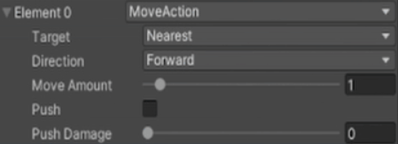
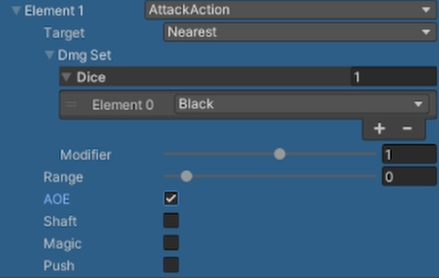

# Turn-Based Combat RPG Project
Taking heavy inspiration from the mechanics of Dark Souls: The Board Game, this is project attempts to create a modular system for enemy and player design alike that is also easily portable to a mobile game. 

Enemies and players are both given "Actions" which tells them the way they are allowed to move and attack on the board.  
An enemy will always have the same Action and therefore always perform their turn in a predictable way. This allows for players to strategize how they would like to spend their own turn.  
Players can get Weapons which will have their own Actions attached to them. Most weapons will have multiple Actions that can be taken for different costs to the player. Players that are out of combat can change Weapons, effectively changing their Actions, as much as they'd like before entering combat again.  
To balance this, enemies will perform their Actions much more often than the player.

---
## Actions
  
There are two main Actions that are performed in this project and in the original game this is based on. These Actions are the Move Action and the Attack Action.  
Actions can be placed in any order and can be repeated as many times as desired.

### Move Action
There are a few parts to the Move Action:
- Target: This goes hand-in-hand with the Direction a character is going.
  - Any: The character can move where I would like.
  - Nearest: The character can move in the chosen Direction dependent on Nearest Target.
  - Aggro: The character can move in the chosen Direction dependent on the Aggro'd Target.
- Direction: This defined the Direction you are allowed to move in.
  - Any: The character can move in any direction they would like.
  - Forward: The character can only move towards the Target.
  - Backward: The character can only move away from the Target.
  - Left: The character can only move left of the Target.
  - Right: The character can only move right of the Target.
- Move Amount: This determines the amount of spaces the character can move.
- Push: This determines if whatever node the character walks on has its characters pushed away or not.
- Push Damage: This deals an amount of damage to whatever has been pushed.  

 

*Here is a showcase of how a Move Action with the Target & Direction set to Any works in-game.*  
  

*Here is a showcase of how a Move Action with the Target set to Nearest & Direction set to Left works in-game.*  
  

### Attack Action
There are a few parts to the Attack Action:
- Target: This holds the same definition as that of the Move Action except this one is for attacking the Target.
- Dmg Set (Damage Set): This is a list of Dice (for random damage) & a modifier (for concrete damage) to determine to amount of total damage to be dealt.
- Range: This determines how close, in terms of nodes, the target has to be in order to able to be hit
- AOE (Area Of Effect): If this box is checked, the amount of damage dealt is dealt to everything in the node instead of just the a single target.
- Shaft: If this box is checked, this attack cannot be performed on nodes with a range of 0 (usually the same node the attacker is on).
- Magic: If this box is checked, this attack will do magic damage instead of physical damage.
- Push: If this box is checked, this attack will also move the target 1 node away from the attacker.
When combined, these parts create a flexible attack system where one attack can differ greatly from another.

 

*Here is a showcase of the Action created at the start of this section*
  
The character (shown as a Green Square) is the one that has the defined Action.  
The opposing character (shown as a Red Triangle) only has a Move Action that allows them to move once in any direction.
 
  
The move action described makes them move forward towards the nearest target (the Red Triangle) by 1 node (valid nodes highlighted in Yellow).  
  
The attack action described makes them attack the nearest target node (AOE), within a range (valid nodes highlighted in Yellow) of 0 (standing on the same node), dealing a Black die (random aspeect) of damage plus 1.
